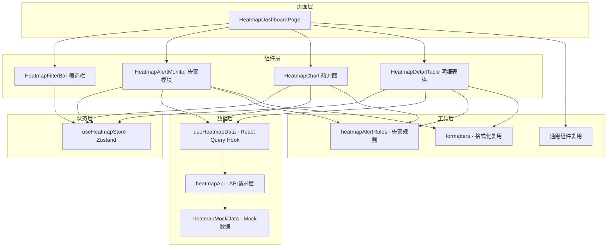
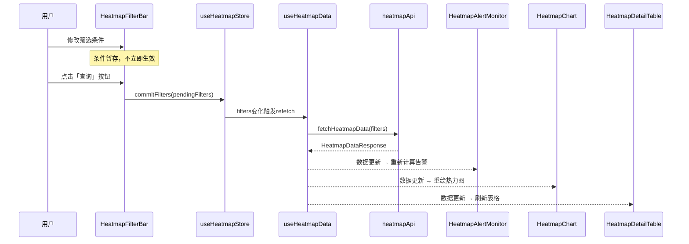
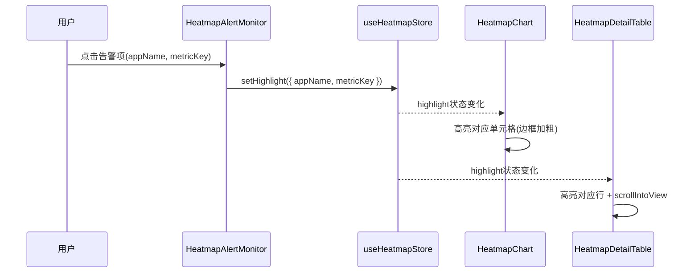

# 设计文档：APP核心指标热力图看板

## 概述

APP核心指标热力图看板是一个独立于现有「可确认收入&利润预测经营看板」的全新页面，用于以热力图形式直观展示各APP在设备数、设备增值订阅转化率、设备增值订阅留存率、单设备收益四个核心指标上的表现。页面包含全局筛选栏、异常告警归因模块、交叉热力图和明细数据表格四大模块，三大数据模块之间通过点击联动实现交互闭环。

该看板采用极简商务风视觉规范（白色背景、浅灰边框），与现有深色驾驶舱主题的经营看板形成差异化定位。新看板创建独立的组件、store和API层，复用现有通用组件（ErrorBoundary、EmptyState、LoadingState）和工具函数（formatters）。

## 架构



## 时序图

### 主流程：筛选查询 → 数据刷新 → 模块联动



### 联动流程：点击告警 → 热力图高亮 → 表格定位



## 组件与接口

### 组件1：HeatmapFilterBar（顶部全局筛选栏）

**职责**：
- 提供设备类型、套餐类型、时间周期三个筛选维度
- 筛选条件修改后暂存于本地state，点击「查询」后才提交到store
- 「重置」恢复默认值并提交
- 固定在页面顶部（position: sticky）

```typescript
interface HeatmapFilterBarProps {
  // 无外部props，通过store通信
}
```

### 组件2：HeatmapAlertMonitor（异常告警预警及归因模块）

**职责**：
- 根据数据和阈值配置生成告警列表
- 按严重程度排序（严重 > 预警），同级按偏离度排序
- 结合筛选条件生成归因文案
- 支持收起/展开
- 点击告警项触发联动

```typescript
interface HeatmapAlertMonitorProps {
  data: HeatmapAppMetric[];
  filters: HeatmapFilters;
  onAlertClick: (appName: string, metricKey: HeatmapMetricKey) => void;
}
```

### 组件3：HeatmapChart（APP×指标交叉热力图）

**职责**：
- 使用ECharts渲染热力图
- Y轴为APP列表（支持排序切换），X轴为4个固定指标
- 单元格仅显示颜色，不显示数值
- 悬浮tooltip显示详细信息
- 点击单元格触发联动
- Y轴支持垂直滚动，X轴固定

```typescript
interface HeatmapChartProps {
  data: HeatmapAppMetric[];
  highlight: HeatmapHighlight | null;
  sortConfig: HeatmapSortConfig;
  filters: HeatmapFilters;
  onCellClick: (appName: string, metricKey: HeatmapMetricKey) => void;
  onSortChange: (config: HeatmapSortConfig) => void;
}
```

### 组件4：HeatmapDetailTable（明细数据表格）

**职责**：
- 使用Ant Design Table展示明细数据
- 表头固定，支持点击排序
- 风险标记与告警/热力图颜色统一
- 联动高亮 + 自动滚动到可见位置
- 分页（默认10条/页，可调10/20/50）
- 导出Excel功能

```typescript
interface HeatmapDetailTableProps {
  data: HeatmapAppMetric[];
  highlight: HeatmapHighlight | null;
  onRowClick: (appName: string) => void;
}
```

## 数据模型

### 筛选条件

```typescript
/** 设备类型枚举 */
type DeviceType = 'all' | 'phone' | 'tablet' | 'smart_hardware';

/** 套餐类型枚举 */
type PackageType = 'all' | 'basic' | 'advanced' | 'premium';

/** 时间周期枚举 */
type TimePeriod = 'last_7_days' | 'last_30_days' | 'natural_month' | 'custom';

/** 热力图筛选条件 */
interface HeatmapFilters {
  deviceType: DeviceType;
  packageType: PackageType;
  timePeriod: TimePeriod;
  customDateRange?: [string, string]; // 仅timePeriod='custom'时有效
}
```

**验证规则**：
- deviceType 默认 'all'
- packageType 默认 'all'
- timePeriod 默认 'last_30_days'
- customDateRange 仅在 timePeriod === 'custom' 时必填
- customDateRange 起始日期不得晚于结束日期

### 核心数据模型

```typescript
/** 热力图指标键 */
type HeatmapMetricKey = 'deviceCount' | 'subscriptionConversionRate' | 'subscriptionRetentionRate' | 'revenuePerDevice';

/** 单个APP的指标数据 */
interface HeatmapAppMetric {
  appName: string;
  deviceCount: number | null;             // 设备数（NULL表示无数据）
  subscriptionConversionRate: number | null; // 设备增值订阅转化率 (0~1)
  subscriptionRetentionRate: number | null;  // 设备增值订阅留存率 (0~1)
  revenuePerDevice: number | null;        // 单设备收益 (元)
  deviceType: string;                     // 设备类型标签
  packageType: string;                    // 套餐类型标签
  yoyChange: Record<HeatmapMetricKey, number | null>;  // 同比变化（如 0.05 = 5%上升，-0.03 = 3%下降）
  momChange: Record<HeatmapMetricKey, number | null>;  // 环比变化
}

/** 告警级别 */
type AlertSeverity = 'critical' | 'warning' | 'normal';

/** 热力图告警项 */
interface HeatmapAlertItem {
  id: string;
  appName: string;
  metricKey: HeatmapMetricKey;
  metricLabel: string;
  severity: AlertSeverity;
  currentValue: number;
  threshold: number;                      // 触发的阈值（黄线或红线）
  deviation: number;                      // 偏离度（与阈值的差值比例）
  attributionText: string;                // 归因文案
}

/** 波动型告警项 */
interface HeatmapVolatilityAlert {
  appName: string;
  metricKey: HeatmapMetricKey;
  type: 'yoy' | 'mom';                   // 同比或环比
  changePercent: number;                  // 变化幅度（如 0.15 = 15%）
}

/** 归因方向类型 */
type AttributionDirection = string;

/** 归因模板映射：指标键 → 预定义归因方向集合 */
type AttributionTemplateMap = Record<HeatmapMetricKey, AttributionDirection[]>;

/** 联动高亮状态 */
interface HeatmapHighlight {
  appName: string;
  metricKey?: HeatmapMetricKey;           // 可选，仅高亮特定指标
}

/** 排序配置 */
interface HeatmapSortConfig {
  field: HeatmapMetricKey | 'appName';
  order: 'asc' | 'desc';
}

/** 色阶级别 */
type HeatmapColorLevel = 'excellent' | 'normal' | 'warning' | 'critical';
```

**验证规则**：
- deviceCount 为 null 或 >= 0 的整数
- subscriptionConversionRate 为 null 或 ∈ [0, 1]
- subscriptionRetentionRate 为 null 或 ∈ [0, 1]
- revenuePerDevice 为 null 或 >= 0
- appName 非空字符串
- yoyChange 和 momChange 的每个指标键对应值为 null 或有效数值

### API响应

```typescript
/** 热力图数据API响应 */
interface HeatmapDataResponse {
  apps: HeatmapAppMetric[];
  updatedAt: string;                      // 数据更新时间
}
```

### 阈值配置

```typescript
/** 热力图告警阈值配置 */
interface HeatmapThresholds {
  deviceCount: { yellow: number; red: number };
  subscriptionConversionRate: { yellow: number; red: number };
  subscriptionRetentionRate: { yellow: number; red: number };
  revenuePerDevice: { yellow: number; red: number };
}

/** 波动型告警阈值配置 */
interface HeatmapVolatilityThresholds {
  yoyMax: number;   // 同比变化幅度阈值（如 0.2 = 20%）
  momMax: number;   // 环比变化幅度阈值（如 0.15 = 15%）
}

```

## 算法伪代码与形式化规约

### 算法1：告警检测与分级

```typescript
function evaluateAlerts(
  apps: HeatmapAppMetric[],
  thresholds: HeatmapThresholds,
  filters: HeatmapFilters
): HeatmapAlertItem[]
```

**前置条件**：
- `apps` 为非空数组，每项 appName 非空
- `thresholds` 所有黄线值 > 对应红线值
- `filters` 为有效筛选条件

**后置条件**：
- 返回数组按严重程度降序排列（critical > warning）
- 同级别按偏离度降序排列
- 不包含 severity === 'normal' 的项
- 每个告警项的 attributionText 包含当前筛选维度信息

**循环不变量**：
- 已处理的APP中，所有超阈值指标均已生成对应告警项

```pascal
ALGORITHM evaluateAlerts(apps, thresholds, filters)
INPUT: apps: HeatmapAppMetric[], thresholds: HeatmapThresholds, filters: HeatmapFilters
OUTPUT: alerts: HeatmapAlertItem[] (按严重程度+偏离度排序)

BEGIN
  alerts ← []

  FOR each app IN apps DO
    FOR each metricKey IN ['deviceCount', 'subscriptionConversionRate', 'subscriptionRetentionRate', 'revenuePerDevice'] DO
      value ← app[metricKey]
      yellowLine ← thresholds[metricKey].yellow
      redLine ← thresholds[metricKey].red

      IF value ≤ redLine THEN
        severity ← 'critical'
        threshold ← redLine
        deviation ← (redLine - value) / redLine
      ELSE IF value ≤ yellowLine THEN
        severity ← 'warning'
        threshold ← yellowLine
        deviation ← (yellowLine - value) / yellowLine
      ELSE
        CONTINUE  // 正常，跳过
      END IF

      attribution ← generateAttribution(app.appName, metricKey, value, threshold, filters)
      alerts.push({ id, appName, metricKey, severity, currentValue: value, threshold, deviation, attributionText: attribution })
    END FOR
  END FOR

  // 排序：严重程度优先，同级按偏离度降序
  SORT alerts BY (severity DESC, deviation DESC)

  RETURN alerts
END
```

### 算法2：热力图色阶映射

```typescript
function getColorLevel(
  value: number,
  metricKey: HeatmapMetricKey,
  thresholds: HeatmapThresholds
): HeatmapColorLevel
```

**前置条件**：
- `value` 为有效数值（非NaN、非Infinity）
- `metricKey` 为有效指标键
- `thresholds[metricKey]` 的 yellow > red

**后置条件**：
- 返回值 ∈ {'excellent', 'normal', 'warning', 'critical'}
- value ≤ red → 'critical'
- red < value ≤ yellow → 'warning'
- yellow < value ≤ excellentLine → 'normal'
- value > excellentLine → 'excellent'

```pascal
ALGORITHM getColorLevel(value, metricKey, thresholds)
INPUT: value: number, metricKey: HeatmapMetricKey, thresholds: HeatmapThresholds
OUTPUT: level: HeatmapColorLevel

BEGIN
  red ← thresholds[metricKey].red
  yellow ← thresholds[metricKey].yellow
  // 优秀线 = 黄线 × 2（可配置）
  excellent ← yellow × 2

  IF value ≤ red THEN
    RETURN 'critical'
  ELSE IF value ≤ yellow THEN
    RETURN 'warning'
  ELSE IF value ≤ excellent THEN
    RETURN 'normal'
  ELSE
    RETURN 'excellent'
  END IF
END
```

### 算法3：归因文案生成（基于归因模板）

```typescript
function generateAttribution(
  appName: string,
  metricKey: HeatmapMetricKey,
  currentValue: number,
  threshold: number,
  filters: HeatmapFilters
): string
```

**前置条件**：
- appName 非空
- currentValue < threshold（已确认为异常）
- filters 为有效筛选条件

**后置条件**：
- 返回非空字符串
- 归因方向来自 getAttributionTemplate(metricKey) 返回的预定义集合
- 每条归因包含1至2个最相关原因
- 无法识别归因时输出默认文案

```pascal
ALGORITHM generateAttribution(appName, metricKey, currentValue, threshold, filters)
INPUT: appName, metricKey, currentValue, threshold, filters
OUTPUT: text: string

BEGIN
  metricLabel ← METRIC_LABELS[metricKey]
  formattedValue ← formatMetricDisplay(currentValue, metricKey)
  formattedThreshold ← formatMetricDisplay(threshold, metricKey)

  // 基于归因模板获取归因方向
  directions ← getAttributionTemplate(metricKey)

  IF directions IS EMPTY THEN
    RETURN "{appName} 的 {metricLabel} 当前为 {formattedValue}，低于阈值 {formattedThreshold}。当前维度下未识别出显著单一原因，请结合明细进一步排查"
  END IF

  // 选取1~2个最相关原因
  selectedReasons ← selectTopReasons(directions, appName, metricKey, filters, maxCount: 2)

  IF selectedReasons IS EMPTY THEN
    RETURN "{appName} 的 {metricLabel} 当前为 {formattedValue}，低于阈值 {formattedThreshold}。当前维度下未识别出显著单一原因，请结合明细进一步排查"
  END IF

  reasonText ← JOIN selectedReasons WITH "、"

  text ← "{appName} 的 {metricLabel} 当前为 {formattedValue}，"
       + "低于阈值 {formattedThreshold}。"
       + "可能原因：{reasonText}"

  RETURN text
END
```

### 算法4：排序与分页

```typescript
function sortAndPaginate(
  data: HeatmapAppMetric[],
  sortConfig: HeatmapSortConfig,
  page: number,
  pageSize: number
): { items: HeatmapAppMetric[]; total: number }
```

**前置条件**：
- data 为数组（可为空）
- page >= 1
- pageSize ∈ {10, 20, 50}

**后置条件**：
- items.length ≤ pageSize
- total === data.length
- items 按 sortConfig 排序后取第 (page-1)*pageSize 到 page*pageSize 项

```pascal
ALGORITHM sortAndPaginate(data, sortConfig, page, pageSize)
INPUT: data: HeatmapAppMetric[], sortConfig, page: number, pageSize: number
OUTPUT: { items: HeatmapAppMetric[], total: number }

BEGIN
  sorted ← SORT data BY sortConfig.field IN sortConfig.order

  startIdx ← (page - 1) × pageSize
  endIdx ← MIN(startIdx + pageSize, sorted.length)

  items ← sorted[startIdx..endIdx]

  RETURN { items, total: data.length }
END
```

### 算法5：波动型告警检测

```typescript
function evaluateVolatilityAlerts(
  apps: HeatmapAppMetric[],
  volatilityThresholds: HeatmapVolatilityThresholds
): HeatmapVolatilityAlert[]
```

**前置条件**：
- `apps` 为数组，每项包含有效的 yoyChange 和 momChange 字段
- `volatilityThresholds.yoyMax` > 0 且 `volatilityThresholds.momMax` > 0

**后置条件**：
- 返回数组中每项的 changePercent 绝对值超过对应阈值
- 不替代绝对阈值告警等级，仅作为辅助风险提示
- 同一指标可同时产生 yoy 和 mom 两条波动告警

**循环不变量**：
- 已处理的APP中，所有超波动阈值的指标均已生成对应波动告警项

```pascal
ALGORITHM evaluateVolatilityAlerts(apps, volatilityThresholds)
INPUT: apps: HeatmapAppMetric[], volatilityThresholds: { yoyMax, momMax }
OUTPUT: alerts: HeatmapVolatilityAlert[]

BEGIN
  alerts ← []

  FOR each app IN apps DO
    FOR each metricKey IN ['deviceCount', 'subscriptionConversionRate', 'subscriptionRetentionRate', 'revenuePerDevice'] DO

      // 检测同比波动
      yoyVal ← app.yoyChange[metricKey]
      IF yoyVal IS NOT NULL AND |yoyVal| > volatilityThresholds.yoyMax THEN
        alerts.push({ appName: app.appName, metricKey, type: 'yoy', changePercent: yoyVal })
      END IF

      // 检测环比波动
      momVal ← app.momChange[metricKey]
      IF momVal IS NOT NULL AND |momVal| > volatilityThresholds.momMax THEN
        alerts.push({ appName: app.appName, metricKey, type: 'mom', changePercent: momVal })
      END IF

    END FOR
  END FOR

  RETURN alerts
END
```

### 算法6：归因模板

```typescript
function getAttributionTemplate(metricKey: HeatmapMetricKey): AttributionDirection[]
```

**前置条件**：
- `metricKey` 为有效的 HeatmapMetricKey

**后置条件**：
- 返回该指标类型对应的预定义归因方向数组
- 返回数组非空（每个指标至少有2个归因方向）

```pascal
ALGORITHM getAttributionTemplate(metricKey)
INPUT: metricKey: HeatmapMetricKey
OUTPUT: directions: AttributionDirection[]

BEGIN
  ATTRIBUTION_TEMPLATES ← {
    'subscriptionConversionRate': ['新增设备占比变化', '高价值套餐渗透率变化', '付费设备数变化'],
    'subscriptionRetentionRate': ['到期设备数上升', '续费设备数下降', '某套餐流失异常'],
    'revenuePerDevice': ['付费套餐结构下移', '高单价套餐渗透下降'],
    'deviceCount': ['某类型设备激活率下降', '某类型设备销量下降']
  }

  directions ← ATTRIBUTION_TEMPLATES[metricKey]

  IF directions IS UNDEFINED THEN
    RETURN []
  END IF

  RETURN directions
END
```

### 算法7：区间内深浅增强

```typescript
function getColorIntensity(
  value: number,
  metricKey: HeatmapMetricKey,
  thresholds: HeatmapThresholds
): number  // 0~1
```

**前置条件**：
- `value` 为有效数值（非NaN、非Infinity、非null）
- `metricKey` 为有效指标键
- `thresholds[metricKey]` 的 yellow > red

**后置条件**：
- 返回值 ∈ [0, 1]
- 值越接近区间上界，返回值越接近 1（颜色越浅）
- 值越接近区间下界，返回值越接近 0（颜色越深）
- 不改变主风险类别（即 getColorLevel 返回值不变）

```pascal
ALGORITHM getColorIntensity(value, metricKey, thresholds)
INPUT: value: number, metricKey: HeatmapMetricKey, thresholds: HeatmapThresholds
OUTPUT: intensity: number (0~1)

BEGIN
  red ← thresholds[metricKey].red
  yellow ← thresholds[metricKey].yellow
  excellent ← yellow × 2

  // 确定当前值所属区间的上下界
  IF value ≤ red THEN
    // critical 区间: [0, red]
    lowerBound ← 0
    upperBound ← red
  ELSE IF value ≤ yellow THEN
    // warning 区间: (red, yellow]
    lowerBound ← red
    upperBound ← yellow
  ELSE IF value ≤ excellent THEN
    // normal 区间: (yellow, excellent]
    lowerBound ← yellow
    upperBound ← excellent
  ELSE
    // excellent 区间: (excellent, +∞)
    // 使用 excellent 到 excellent×2 作为参考范围
    lowerBound ← excellent
    upperBound ← excellent × 2
  END IF

  // 计算区间内相对位置
  IF upperBound = lowerBound THEN
    RETURN 0.5
  END IF

  intensity ← (value - lowerBound) / (upperBound - lowerBound)
  intensity ← CLAMP(intensity, 0, 1)

  RETURN intensity
END
```

### 算法8：同值回退排序

```typescript
function sortWithTieBreaking(
  data: HeatmapAppMetric[],
  sortConfig: HeatmapSortConfig
): HeatmapAppMetric[]
```

**前置条件**：
- `data` 为数组（可为空）
- `sortConfig.field` 为有效排序字段
- `sortConfig.order` ∈ {'asc', 'desc'}

**后置条件**：
- 返回数组按 sortConfig 指定字段排序
- 同值时按回退优先级排序：设备数 > 单设备收益 > 转化率 > 留存率 > APP名称
- NULL 值排末尾（无论升序或降序）
- 0 视为有效数值，正常参与排序

```pascal
ALGORITHM sortWithTieBreaking(data, sortConfig)
INPUT: data: HeatmapAppMetric[], sortConfig: { field, order }
OUTPUT: sorted: HeatmapAppMetric[]

BEGIN
  TIE_BREAK_PRIORITY ← ['deviceCount', 'revenuePerDevice', 'subscriptionConversionRate', 'subscriptionRetentionRate', 'appName']

  sorted ← SORT data USING comparator(a, b):
    // 主排序字段
    result ← compareValues(a[sortConfig.field], b[sortConfig.field], sortConfig.order)

    IF result ≠ 0 THEN
      RETURN result
    END IF

    // 同值回退排序（始终降序，除 appName 为升序）
    FOR each tieField IN TIE_BREAK_PRIORITY DO
      IF tieField = sortConfig.field THEN
        CONTINUE  // 跳过主排序字段
      END IF

      IF tieField = 'appName' THEN
        result ← compareStrings(a.appName, b.appName, 'asc')
      ELSE
        result ← compareValues(a[tieField], b[tieField], 'desc')
      END IF

      IF result ≠ 0 THEN
        RETURN result
      END IF
    END FOR

    RETURN 0
  END comparator

  RETURN sorted
END

FUNCTION compareValues(valA, valB, order)
BEGIN
  // NULL 排末尾（无论升序或降序）
  IF valA IS NULL AND valB IS NULL THEN RETURN 0
  IF valA IS NULL THEN RETURN 1   // A排后面
  IF valB IS NULL THEN RETURN -1  // B排后面

  // 0 视为有效数值，正常比较
  IF order = 'asc' THEN
    RETURN valA - valB
  ELSE
    RETURN valB - valA
  END IF
END
```

### 算法9：时间口径计算

```typescript
function computeDateRange(
  timePeriod: TimePeriod,
  customRange?: [string, string]
): [string, string]
```

**前置条件**：
- `timePeriod` 为有效的 TimePeriod 枚举值
- 当 timePeriod === 'custom' 时，customRange 必须提供且起始日期 ≤ 结束日期

**后置条件**：
- 返回 [startDate, endDate] 闭区间，格式为 'YYYY-MM-DD'
- 近7天：含今天在内的连续7天（今天往前推6天至今天）
- 近30天：含今天在内的连续30天（今天往前推29天至今天）
- 自然月：当月1日至当前日期
- 自定义：等于传入的 customRange（闭区间）

```pascal
ALGORITHM computeDateRange(timePeriod, customRange)
INPUT: timePeriod: TimePeriod, customRange?: [string, string]
OUTPUT: [startDate, endDate]: [string, string]

BEGIN
  today ← getCurrentDate()  // 'YYYY-MM-DD'

  SWITCH timePeriod
    CASE 'last_7_days':
      startDate ← addDays(today, -6)
      endDate ← today
      RETURN [startDate, endDate]

    CASE 'last_30_days':
      startDate ← addDays(today, -29)
      endDate ← today
      RETURN [startDate, endDate]

    CASE 'natural_month':
      startDate ← getFirstDayOfMonth(today)  // 当月1日
      endDate ← today
      RETURN [startDate, endDate]

    CASE 'custom':
      ASSERT customRange IS NOT NULL
      ASSERT customRange[0] ≤ customRange[1]
      RETURN customRange

  END SWITCH
END
```

### 算法10：指标展示格式化

```typescript
function formatMetricDisplay(
  value: number | null,
  metricKey: HeatmapMetricKey
): string
```

**前置条件**：
- `metricKey` 为有效的 HeatmapMetricKey

**后置条件**：
- NULL → '--'
- deviceCount → 整数格式（如 '12345'）
- subscriptionConversionRate → 百分比格式（如 '25.3%'）
- subscriptionRetentionRate → 百分比格式（如 '48.7%'）
- revenuePerDevice → 带单位格式（如 '18.50元'）

```pascal
ALGORITHM formatMetricDisplay(value, metricKey)
INPUT: value: number | null, metricKey: HeatmapMetricKey
OUTPUT: formatted: string

BEGIN
  IF value IS NULL THEN
    RETURN '--'
  END IF

  SWITCH metricKey
    CASE 'deviceCount':
      RETURN toString(ROUND(value))                    // 整数，如 '12345'

    CASE 'subscriptionConversionRate':
      RETURN toString(ROUND(value × 100, 1)) + '%'    // 百分比，如 '25.3%'

    CASE 'subscriptionRetentionRate':
      RETURN toString(ROUND(value × 100, 1)) + '%'    // 百分比，如 '48.7%'

    CASE 'revenuePerDevice':
      RETURN toString(ROUND(value, 2)) + '元'          // 带单位，如 '18.50元'

  END SWITCH
END
```

## 关键函数形式化规约

### useHeatmapStore

```typescript
interface HeatmapStore {
  // 筛选条件（已提交的）
  filters: HeatmapFilters;
  // 暂存的筛选条件（未提交）
  pendingFilters: HeatmapFilters;

  // 联动高亮
  highlight: HeatmapHighlight | null;

  // 排序配置
  sortConfig: HeatmapSortConfig;

  // Actions
  setPendingFilters: (partial: Partial<HeatmapFilters>) => void;
  commitFilters: () => void;
  resetFilters: () => void;
  setHighlight: (h: HeatmapHighlight | null) => void;
  setSortConfig: (config: HeatmapSortConfig) => void;
}
```

**前置条件**：
- commitFilters: pendingFilters 为有效筛选条件
- resetFilters: 无

**后置条件**：
- commitFilters: filters === 调用前的 pendingFilters
- resetFilters: filters === defaultHeatmapFilters && pendingFilters === defaultHeatmapFilters && highlight === null

### useHeatmapData (React Query Hook)

```typescript
function useHeatmapData(filters: HeatmapFilters): {
  data: HeatmapDataResponse | undefined;
  isLoading: boolean;
  isError: boolean;
  error: Error | null;
}
```

**前置条件**：
- filters 为有效 HeatmapFilters

**后置条件**：
- filters 变化时自动触发 refetch
- isLoading 期间 data 为 undefined
- 成功时 data.apps 为 HeatmapAppMetric[]
- 失败时 isError === true 且 error 非 null

### heatmapApi

```typescript
async function fetchHeatmapData(filters: HeatmapFilters): Promise<HeatmapDataResponse>
```

**前置条件**：
- filters 为有效 HeatmapFilters

**后置条件**：
- 返回 HeatmapDataResponse，apps 数组中每项满足数据模型验证规则
- USE_MOCK=true 时返回 mock 数据，延迟 300ms

## 示例用法

```typescript
// 1. Store 使用
const { filters, pendingFilters, setPendingFilters, commitFilters, resetFilters, highlight, setHighlight } = useHeatmapStore();

// 修改筛选条件（暂存）
setPendingFilters({ deviceType: 'phone' });

// 提交筛选（触发数据刷新）
commitFilters();

// 重置
resetFilters();

// 2. 数据获取
const { data, isLoading, isError } = useHeatmapData(filters);

// 3. 告警计算
const alerts = evaluateAlerts(data.apps, DEFAULT_HEATMAP_THRESHOLDS, filters);

// 4. 联动交互
// 点击告警 → 高亮热力图+表格
setHighlight({ appName: 'APP-A', metricKey: 'deviceCount' });

// 点击热力图单元格 → 高亮表格+告警
setHighlight({ appName: 'APP-B', metricKey: 'subscriptionConversionRate' });

// 5. 色阶映射
const level = getColorLevel(3000, 'deviceCount', DEFAULT_HEATMAP_THRESHOLDS);
// level === 'warning' (3000 ≤ 5000 黄线)

// 6. 区间内深浅增强
const intensity = getColorIntensity(3000, 'deviceCount', DEFAULT_HEATMAP_THRESHOLDS);
// intensity ≈ 0.33 (3000在warning区间[2000, 5000]中的相对位置)

// 7. 波动型告警检测
const volatilityAlerts = evaluateVolatilityAlerts(data.apps, { yoyMax: 0.2, momMax: 0.15 });
// 返回同比/环比变化超阈值的辅助告警列表

// 8. 归因模板
const directions = getAttributionTemplate('subscriptionConversionRate');
// directions === ['新增设备占比变化', '高价值套餐渗透率变化', '付费设备数变化']

// 9. 同值回退排序
const sorted = sortWithTieBreaking(data.apps, { field: 'deviceCount', order: 'desc' });
// 设备数相同时按 单设备收益 > 转化率 > 留存率 > APP名称 回退排序

// 10. 时间口径计算
const [start, end] = computeDateRange('last_7_days');
// start === '2026-03-24', end === '2026-03-30' (假设今天是2026-03-30)

// 11. 指标展示格式化
formatMetricDisplay(12345, 'deviceCount');           // '12345'
formatMetricDisplay(0.253, 'subscriptionConversionRate'); // '25.3%'
formatMetricDisplay(18.5, 'revenuePerDevice');       // '18.50元'
formatMetricDisplay(null, 'deviceCount');             // '--'

// 12. 导出Excel
function exportToExcel(data: HeatmapAppMetric[]): void {
  // 使用 Ant Design Table 的数据格式，生成 CSV/XLSX
}
```

## 正确性属性

*属性是系统在所有有效执行中应保持为真的特征或行为——本质上是关于系统应该做什么的形式化陈述。属性是人类可读规范与机器可验证正确性保证之间的桥梁。*

### Property 1: 告警分级一致性

*For any* APP指标数据和阈值配置，evaluateAlerts 对每个指标的分级结果应满足：值 ≤ 红线 → critical，红线 < 值 ≤ 黄线 → warning，值 > 黄线 → 不生成告警项。

**Validates: Requirements 2.2, 2.3, 2.4**

### Property 2: 告警排序正确性

*For any* 告警列表，排序后应满足：严重程度降序（critical 优先于 warning），同级别按偏离度降序排列，偏离度相同时按APP默认排序。即对于任意相邻两项 alerts[i] 和 alerts[i+1]，要么 alerts[i].severity > alerts[i+1].severity，要么两者 severity 相同且 alerts[i].deviation > alerts[i+1].deviation，要么两者 severity 和 deviation 均相同且 alerts[i].appName ≤ alerts[i+1].appName。

**Validates: Requirements 2.5, 13.4**

### Property 3: 色阶映射一致性

*For any* 数值、指标键和阈值配置，getColorLevel 的映射结果应满足：值 ≤ 红线 → critical，红线 < 值 ≤ 黄线 → warning，黄线 < 值 ≤ 优秀线（黄线×2）→ normal，值 > 优秀线 → excellent。

**Validates: Requirements 4.3, 4.4, 4.5, 4.6**

### Property 4: 告警与色阶跨模块一致性

*For any* APP指标数据和阈值配置，evaluateAlerts 产生的告警级别与 getColorLevel 对同一指标值的色阶映射应一致：critical 告警对应 critical 色阶，warning 告警对应 warning 色阶，无告警对应 normal 或 excellent 色阶。明细表格的风险标记颜色也应与此一致。

**Validates: Requirements 5.7, 10.3**

### Property 5: 筛选状态管理正确性

*For any* 筛选条件修改序列，setPendingFilters 仅改变 pendingFilters 而不改变 committedFilters；commitFilters 后 filters 应等于调用前的 pendingFilters；resetFilters 后 filters 和 pendingFilters 均应等于默认值且 highlight 为 null。

**Validates: Requirements 1.2, 1.3, 1.4**

### Property 6: 联动高亮状态正确性

*For any* 用户点击操作（告警项、热力图单元格或表格行），高亮状态应正确设置：点击告警项或热力图单元格时 highlight 包含 appName 和 metricKey；点击表格行时 highlight 包含 appName 但不包含 metricKey。所有模块使用统一的高亮状态格式。

**Validates: Requirements 2.8, 4.9, 6.1, 6.2, 6.3**

### Property 7: 联动高亮切换

*For any* 已激活的高亮状态，当用户再次点击同一元素时，高亮状态应被清除为 null。

**Validates: Requirement 6.4**

### Property 8: 归因模板合规性

*For any* 告警项，生成的归因文案应基于规则模板，归因方向应属于该指标类型的预定义集合（转化率→{新增设备占比变化, 高价值套餐渗透率变化, 付费设备数变化}，留存率→{到期设备数上升, 续费设备数下降, 某套餐流失异常}，单设备收益→{付费套餐结构下移, 高单价套餐渗透下降}，设备数→{某类型设备激活率下降, 某类型设备销量下降}），每条归因包含1至2个原因。无法识别归因时输出默认文案。

**Validates: Requirements 2.6, 2.9, 14.1, 14.2, 14.3, 14.4, 14.5, 14.6, 14.7**

### Property 9: 数据验证完整性

*For any* 输入数据，验证函数应确保：deviceCount 为非负整数，subscriptionConversionRate ∈ [0, 1]，subscriptionRetentionRate ∈ [0, 1]，revenuePerDevice 为非负数值，appName 为非空字符串。不满足条件的数据应被拒绝。

**Validates: Requirements 8.1, 8.2, 8.3, 8.4, 8.5**

### Property 10: 分页完整性

*For any* 数据集、排序配置和 pageSize（10/20/50），遍历所有分页后各页数据条数之和应等于总数据条数，每页条数不超过 pageSize，且分页前数据应按排序配置排序。

**Validates: Requirements 9.1, 9.2, 9.3**

### Property 11: 表格排序与同值回退正确性

*For any* APP指标数据集和排序列，排序后数据应按该列严格有序（升序或降序）。当排序列值相同时，应按回退优先级排序：设备数 > 单设备收益 > 转化率 > 留存率，以上仍相同则按APP名称排序。NULL值排序时放置在末尾。

**Validates: Requirements 5.3, 5.9, 5.10**

### Property 12: 日期范围验证

*For any* 两个日期，当起始日期晚于结束日期时，筛选条件验证应拒绝该日期范围。

**Validates: Requirement 1.5**

### Property 13: 阈值层级约束

*For any* 指标的阈值配置，黄线阈值应严格大于红线阈值。

**Validates: Requirement 3.2**

### Property 14: 时间范围计算正确性

*For any* 给定的当前日期，「近7天」应计算为含今天在内的连续7天（今天往前推6天至今天），「近30天」应计算为含今天在内的连续30天（今天往前推29天至今天），「自然月」应计算为当月1日至当前日期，「自定义」应为包含起始日和结束日的闭区间。

**Validates: Requirements 1.7, 1.8, 1.9, 1.10**

### Property 15: 热力图区间内深浅变化

*For any* 热力图单元格，在同一风险色阶区间内，色彩深浅应与当前值在该区间中的相对位置成正比。深浅变化不改变主风险类别（即 getColorLevel 返回值不变）。

**Validates: Requirement 4.13**

### Property 16: 波动型告警优先级

*For any* 指标数据，波动型告警（同比/环比异常）不替代绝对阈值告警等级。当某指标同时命中绝对阈值告警和波动型告警时，展示的告警级别应为绝对阈值等级。未触发绝对阈值但触发波动异常的单元格，应通过辅助视觉提示（描边/角标/图标）标识，不改变主色阶颜色类别。

**Validates: Requirements 13.1, 13.2, 13.3, 4.14**

### Property 17: 空值与零值处理

*For any* 包含 NULL 值和 0 值的数据集，NULL/无数据应展示为「--」且排序时放置在末尾（无论升序或降序）；0 应视为有效数值，正常参与排序和展示。

**Validates: Requirements 5.9, 5.10**

### Property 18: 导出数据正确性

*For any* 筛选条件和分页状态，「导出当前筛选结果」应包含当前筛选条件下的全量数据（不受分页限制），「导出当前页」应仅包含当前页码的数据。两种导出的字段应与明细表格列一致，格式为Excel。

**Validates: Requirements 5.6, 5.8**

### Property 19: 指标公式正确性

*For any* 原始数据，设备增值订阅转化率应等于设备首次订阅增值数除以设备激活数，设备增值订阅留存率应等于当前在订设备数除以历史订阅设备数，单设备收益应等于设备收益除以活跃设备数。

**Validates: Requirements 11.3, 11.4, 11.5**

### Property 20: 指标展示格式

*For any* 指标值和指标类型，设备数应格式化为整数，设备增值订阅转化率和设备增值订阅留存率应格式化为百分比，单设备收益应格式化为带单位「元」的数值。

**Validates: Requirement 11.7**

### Property 21: 数据更新时间格式

*For any* 时间戳，数据更新时间应格式化为「数据更新时间：YYYY-MM-DD HH:mm」格式。

**Validates: Requirement 12.2**

## 错误处理

### 场景1：API请求失败

**条件**：网络错误或服务端返回非200状态码
**响应**：React Query 自动重试3次，失败后 isError=true
**恢复**：ErrorBoundary 展示错误提示，用户可点击重试

### 场景2：数据为空

**条件**：API返回 apps 为空数组
**响应**：各模块展示 EmptyState 组件，显示「当前筛选条件下无数据」
**恢复**：用户调整筛选条件后重新查询

### 场景3：自定义日期范围无效

**条件**：用户选择的起始日期晚于结束日期
**响应**：DatePicker 组件层面禁止选择，commitFilters 前校验
**恢复**：提示用户重新选择有效日期范围

### 场景4：ECharts渲染异常

**条件**：数据格式异常导致ECharts渲染失败
**响应**：ErrorBoundary 捕获异常，展示降级UI
**恢复**：用户刷新页面或调整筛选条件

## 测试策略

### 单元测试

- `evaluateAlerts`：验证告警分级、排序、归因文案生成
- `getColorLevel`：验证色阶映射边界值
- `getColorIntensity`：验证区间内深浅增强返回值在 [0, 1] 且不改变主风险类别
- `generateAttribution`：验证基于归因模板生成文案，每条1~2个原因，无法识别时输出默认文案
- `getAttributionTemplate`：验证各指标类型返回正确的归因方向集合
- `evaluateVolatilityAlerts`：验证同比/环比波动检测，不替代绝对阈值告警
- `sortWithTieBreaking`：验证同值回退排序优先级和NULL排末尾
- `computeDateRange`：验证各时间周期的日期范围计算
- `formatMetricDisplay`：验证各指标类型的格式化输出和NULL处理
- `useHeatmapStore`：验证 commitFilters/resetFilters 状态变更
- `sortAndPaginate`：验证排序和分页逻辑

### Property-Based 测试

**测试库**：fast-check

- 告警分级一致性：随机生成 APP 指标数据，验证分级结果与阈值关系
- 排序稳定性：随机生成告警列表，验证排序后满足严重程度+偏离度降序
- 色阶映射与告警一致性：随机生成数值，验证 getColorLevel 与 evaluateAlerts 结果一致
- 分页完整性：随机生成数据和分页参数，验证所有页合并后等于原始数据
- 归因模板合规性：随机生成告警项，验证归因方向属于预定义集合，每条1~2个原因
- 区间内深浅变化：随机生成值和阈值，验证 getColorIntensity 返回 [0, 1] 且不改变主风险类别
- 波动型告警优先级：验证波动告警不替代绝对阈值等级
- 同值回退排序：随机生成数据，验证回退优先级和NULL排末尾
- 时间范围计算：随机生成日期，验证各时间周期计算结果
- 指标展示格式：随机生成值和指标类型，验证格式化输出

### 集成测试

- 筛选 → 查询 → 数据刷新全流程
- 告警点击 → 热力图高亮 → 表格定位联动
- 热力图点击 → 表格高亮 → 告警聚焦联动
- 重置筛选 → 所有模块恢复默认状态

## 性能考虑

- 热力图Y轴支持虚拟滚动，APP数量较多时避免DOM节点过多
- 明细表格使用 Ant Design Table 内置虚拟化（数据量大时）
- 告警计算使用 useMemo 缓存，仅在数据或阈值变化时重新计算
- React Query 设置 staleTime=5min，避免频繁请求
- 筛选条件暂存机制避免每次修改都触发请求

## 安全考虑

- 筛选参数在提交前进行校验，防止注入
- API请求使用现有 apiClient（含拦截器和错误处理）
- 导出Excel时对数据进行脱敏处理（如有敏感字段）

## 依赖

- 现有依赖（无需新增）：
  - `react` / `react-dom` - UI框架
  - `antd` - Table、Select、DatePicker、Button、Collapse 组件
  - `echarts` / `echarts-for-react` - 热力图渲染
  - `zustand` - 状态管理
  - `@tanstack/react-query` - 数据请求
  - `fast-check` - Property-Based 测试
- 复用现有模块：
  - `src/components/common/ErrorBoundary` - 错误边界
  - `src/components/common/EmptyState` - 空状态
  - `src/components/common/LoadingState` - 加载状态
  - `src/utils/formatters.ts` - 数值格式化
  - `src/api/client.ts` - API客户端
