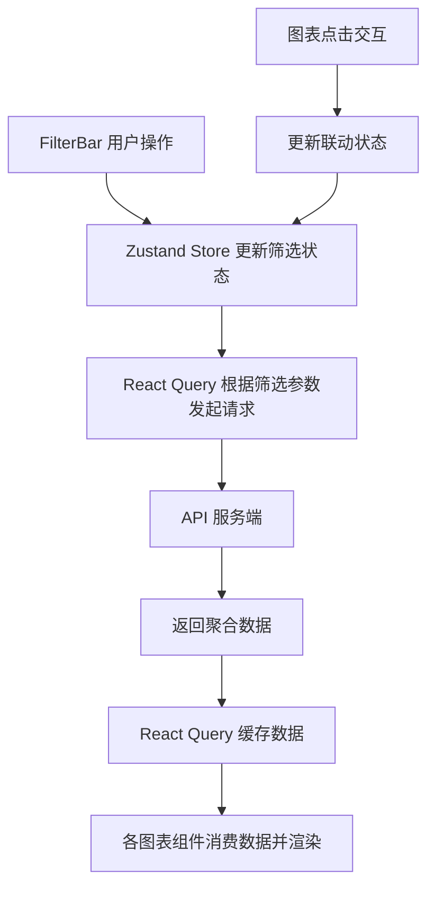
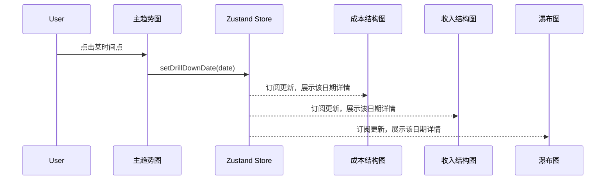

# 技术设计文档：可确认收入&利润经营看板

## 概述

本设计文档描述可确认收入&利润经营看板的前端技术方案。该看板面向运营团队，采用驾驶舱经营分析风格，核心围绕可确认收入趋势、利润趋势和套餐盈利能力分析三大主题。

技术选型：
- **框架**：React 18 + TypeScript
- **构建工具**：Vite
- **图表库**：Apache ECharts（通过 echarts-for-react 集成）
- **状态管理**：Zustand（轻量级，适合看板类应用的全局筛选状态共享）
- **HTTP 请求**：Axios + React Query（TanStack Query，负责数据缓存与请求状态管理）
- **UI 组件库**：Ant Design 5.x（提供筛选栏所需的 Select、DatePicker、Radio 等组件）
- **样式方案**：CSS Modules + CSS Variables（实现深色驾驶舱主题）
- **测试**：Vitest + fast-check（属性测试）

选型理由：
- ECharts 原生支持柱线组合图、堆叠柱图、瀑布图、横向条形图等需求中涉及的全部图表类型，且对大数据量渲染性能优秀
- Zustand 相比 Redux 更轻量，看板场景下全局状态主要是筛选条件，不需要复杂的中间件
- React Query 自动处理请求缓存、去重、后台刷新，减少重复请求
- Ant Design 提供成熟的多选 Select、DatePicker 等组件，减少筛选栏开发量

## 架构

### 整体架构

```
┌─────────────────────────────────────────────────────────┐
│                    Dashboard Page                        │
│  ┌───────────────────────────────────────────────────┐  │
│  │              FilterBar (全局筛选栏)                 │  │
│  └───────────────────────────────────────────────────┘  │
│  ┌───────────────────────────────────────────────────┐  │
│  │              KPICardRow (核心指标区)                │  │
│  └───────────────────────────────────────────────────┘  │
│  ┌───────────────────────────────────────────────────┐  │
│  │          MainTrendChart (主趋势分析)                │  │
│  └───────────────────────────────────────────────────┘  │
│  ┌──────────────────────┐ ┌──────────────────────────┐  │
│  │ CostStructureChart   │ │ RevenueStructureChart    │  │
│  │ (成本结构趋势)        │ │ (收入结构趋势)            │  │
│  └──────────────────────┘ └──────────────────────────┘  │
│  ┌──────────────────────┐ ┌──────────────────────────┐  │
│  │ WaterfallChart       │ │ PackageProfitRanking     │  │
│  │ (利润瀑布图)          │ │ (套餐盈利排行)            │  │
│  └──────────────────────┘ └──────────────────────────┘  │
│  ┌──────────────────────┐ ┌──────────────────────────┐  │
│  │ CostDetailCharts     │ │ AlertMonitor             │  │
│  │ (成本专项分析)        │ │ (异常监控告警)            │  │
│  └──────────────────────┘ └──────────────────────────┘  │
│                                                         │
│  ┌───────────────────────────────────────────────────┐  │
│  │           Zustand Store (全局筛选状态)              │  │
│  └───────────────────────────────────────────────────┘  │
│  ┌───────────────────────────────────────────────────┐  │
│  │     React Query (数据请求缓存层)                    │  │
│  └───────────────────────────────────────────────────┘  │
└─────────────────────────────────────────────────────────┘
```

### 数据流架构



### 图表联动机制




## 组件与接口

### 目录结构

```
src/
├── App.tsx                          # 根组件
├── main.tsx                         # 入口
├── theme/
│   └── variables.css                # 深色驾驶舱主题 CSS 变量
├── store/
│   └── useDashboardStore.ts         # Zustand 全局筛选状态
├── api/
│   ├── client.ts                    # Axios 实例配置
│   └── dashboard.ts                 # 看板 API 请求函数
├── hooks/
│   ├── useDashboardData.ts          # React Query 数据获取 hooks
│   └── useChartInteraction.ts       # 图表联动交互 hook
├── types/
│   └── dashboard.ts                 # TypeScript 类型定义
├── components/
│   ├── FilterBar/
│   │   └── FilterBar.tsx            # 统一筛选栏
│   ├── KPICard/
│   │   ├── KPICard.tsx              # 单个指标卡
│   │   └── KPICardRow.tsx           # 指标卡行容器
│   ├── charts/
│   │   ├── MainTrendChart.tsx       # 主趋势柱线组合图
│   │   ├── CostStructureChart.tsx   # 成本结构堆叠柱图
│   │   ├── RevenueStructureChart.tsx# 收入结构趋势图
│   │   ├── WaterfallChart.tsx       # 利润瀑布图
│   │   ├── PackageProfitRanking.tsx # 套餐盈利排行条形图
│   │   └── CostDetailCharts.tsx     # 成本专项分析图表组
│   ├── AlertMonitor/
│   │   ├── AlertMonitor.tsx         # 异常监控区域
│   │   └── AlertCard.tsx            # 单个告警卡片
│   └── DashboardPage.tsx            # 看板主页面布局
└── utils/
    ├── formatters.ts                # 数值格式化工具
    ├── alertRules.ts                # 告警规则计算
    └── chartHelpers.ts              # 图表配置辅助函数
```

### 核心组件接口

#### FilterBar

```typescript
// FilterBar 不接收 props，直接读写 Zustand Store
const FilterBar: React.FC = () => {
  const { filters, setFilters } = useDashboardStore();
  // 渲染时间范围、时间粒度、订单类型、设备类型、套餐类型、套餐版本选择器
};
```

#### KPICard

```typescript
interface KPICardProps {
  title: string;
  value: number | string;
  unit?: string;
  changePercent: number;       // 环比变化百分比，正值为增长，负值为下降
  sparklineData: number[];     // 迷你折线图数据点
  highlighted?: boolean;       // 是否为突出展示样式
}
```

#### 图表组件通用模式

所有图表组件遵循统一模式：
1. 从 Zustand Store 读取筛选状态和联动状态
2. 通过 React Query hook 获取数据
3. 将数据转换为 ECharts option 配置
4. 渲染 ReactECharts 组件

```typescript
// 以 MainTrendChart 为例
const MainTrendChart: React.FC = () => {
  const filters = useDashboardStore(state => state.filters);
  const drillDownDate = useDashboardStore(state => state.drillDownDate);
  const { data, isLoading } = useMainTrendData(filters);
  
  const option = buildMainTrendOption(data, drillDownDate);
  
  const handleClick = (params: ECElementEvent) => {
    useDashboardStore.getState().setDrillDownDate(params.name);
  };
  
  return <ReactECharts option={option} onEvents={{ click: handleClick }} />;
};
```

#### AlertCard

```typescript
interface AlertCardProps {
  severity: 'warning' | 'critical';  // 橙色 | 红色
  title: string;                      // 告警标题
  productType?: string;               // 异常产品类型
  currentValue: number;               // 当前值
  threshold: number;                  // 阈值
  changePercent?: number;             // 变化幅度
}
```

### Zustand Store 接口

```typescript
interface DashboardFilters {
  dateRange: [string, string];        // 起止日期 ISO 格式
  timeGranularity: 'day' | 'week' | 'month';
  orderTypes: string[];               // 多选
  deviceTypes: string[];              // 多选
  productTypes: string[];             // 多选
  packageVersions: string[];          // 多选
}

interface DashboardStore {
  filters: DashboardFilters;
  setFilters: (partial: Partial<DashboardFilters>) => void;
  resetFilters: () => void;
  
  // 图表联动状态
  drillDownDate: string | null;       // 主趋势图点击的时间点
  drillDownProduct: string | null;    // 套餐排行图点击的产品类型
  setDrillDownDate: (date: string | null) => void;
  setDrillDownProduct: (product: string | null) => void;
  clearDrillDown: () => void;
}
```


## 数据模型

### API 接口设计

所有接口统一接收筛选参数，返回聚合后的数据。

#### 1. KPI 指标接口

```
GET /api/dashboard/kpi
```

请求参数：`DashboardFilters`（同 Zustand Store 中的筛选条件）

```typescript
interface KPIResponse {
  confirmedRevenue: KPIMetric;
  costPrediction: KPIMetric;
  profitPrediction: KPIMetric;
  profitMargin: KPIMetric;
  topProfitPackage: TopPackageMetric;
  topMarginPackage: TopPackageMetric;
}

interface KPIMetric {
  value: number;
  changePercent: number;          // 环比变化百分比
  sparkline: number[];            // 近期趋势数据点（7~30个点）
}

interface TopPackageMetric {
  productType: string;            // 产品类型名称
  value: number;                  // 利润额或利润率
  changePercent: number;
}
```

#### 2. 主趋势数据接口

```
GET /api/dashboard/main-trend
```

```typescript
interface MainTrendResponse {
  dates: string[];                // 时间轴标签
  confirmedRevenue: number[];     // 可确认收入序列
  costPrediction: number[];       // 成本预测序列
  profitPrediction: number[];     // 利润预测序列
  profitMargin: number[];         // 利润率序列（百分比）
}
```

#### 3. 成本结构数据接口

```
GET /api/dashboard/cost-structure
```

```typescript
interface CostStructureResponse {
  dates: string[];
  serverCost: number[];
  trafficCost: number[];
  paymentFee: number[];
  meariShareCost: number[];
  customerShareCost: number[];
}
```

#### 4. 收入结构数据接口

```
GET /api/dashboard/revenue-structure
```

```typescript
interface RevenueStructureResponse {
  dates: string[];
  meariRevenue: number[];
  customerRevenue: number[];
  totalConfirmedRevenue: number[];
}
```

#### 5. 瀑布图数据接口

```
GET /api/dashboard/waterfall
```

```typescript
interface WaterfallResponse {
  totalRevenue: number;
  serverCost: number;
  trafficCost: number;
  paymentFee: number;
  meariShareCost: number;
  customerShareCost: number;
  profit: number;
}
```

#### 6. 套餐盈利排行接口

```
GET /api/dashboard/package-ranking
```

额外参数：`dimension: 'productType' | 'packageVersion'`，`metric: 'profit' | 'profitMargin' | 'revenue' | 'cost'`

```typescript
interface PackageRankingResponse {
  items: PackageRankingItem[];
}

interface PackageRankingItem {
  name: string;                   // 产品类型或套餐版本名称
  profit: number;
  profitMargin: number;
  revenue: number;
  cost: number;
}
```

#### 7. 成本专项分析接口

```
GET /api/dashboard/cost-detail
```

```typescript
interface CostDetailResponse {
  dates: string[];
  paymentFee: number[];
  trafficCost: number[];
  meariShareCost: number[];
  customerShareCost: number[];
}
```

#### 8. 异常告警接口

```
GET /api/dashboard/alerts
```

```typescript
interface AlertResponse {
  alerts: AlertItem[];
}

interface AlertItem {
  id: string;
  type: 'profitMargin' | 'paymentFee' | 'trafficCost';
  severity: 'warning' | 'critical';
  title: string;
  productType?: string;
  deviceType?: string;
  currentValue: number;
  threshold: number;
  changePercent?: number;
}
```

### 告警规则模型

```typescript
interface AlertThresholds {
  profitMarginMin: number;            // 利润率最低阈值（如 0.1 = 10%）
  paymentFeeChangeMax: number;        // 手续费率环比变化最大阈值（如 0.05 = 5%）
  trafficCostPerDeviceChangeMax: number; // 单设备流量成本环比变化最大阈值
}

// 告警严重程度判定
// critical: 超过阈值 2 倍以上
// warning: 超过阈值但未达 2 倍
```

### 数值格式化规则

```typescript
// 金额：千分位分隔 + 2 位小数，如 ¥1,234,567.89
// 百分比：1 位小数 + % 后缀，如 23.5%
// 环比变化：带正负号 + 1 位小数 + %，如 +5.2% / -3.1%
// 大数缩写：超过万时显示为 x.xx万，超过亿时显示为 x.xx亿
```


## 正确性属性（Correctness Properties）

*属性（Property）是指在系统所有有效执行中都应成立的特征或行为——本质上是对系统应做什么的形式化陈述。属性是人类可读规格说明与机器可验证正确性保证之间的桥梁。*

### Property 1: 筛选条件变更触发数据重新请求

*For any* 筛选条件组合（时间范围、时间粒度、订单类型、设备类型、套餐类型、套餐版本的任意子集变更），React Query 的所有看板数据查询都应使用更新后的筛选参数重新发起请求。

**Validates: Requirements 1.3, 1.6, 2.5, 3.6, 4.4, 5.5, 6.5, 7.7, 8.5**

### Property 2: 时间粒度互斥性

*For any* 时间粒度切换操作序列，Zustand Store 中的 `timeGranularity` 状态在任意时刻有且仅有一个值（'day' | 'week' | 'month'），不存在多选或空选状态。

**Validates: Requirements 1.5**

### Property 3: KPI 卡片环比变化方向指示正确性

*For any* KPIMetric 数据（包含任意正数、负数、零的 changePercent），KPI_Card 渲染结果应满足：正值显示绿色上箭头，负值显示红色下箭头，零值不显示箭头或显示中性状态。同时，渲染结果应包含主数值和迷你折线图。

**Validates: Requirements 2.2, 2.4**

### Property 4: Top N 排行取值正确性

*For any* PackageRankingItem 列表（非空）和任意排序指标（利润额或利润率），Top N KPI_Card 展示的产品应为该指标值最大的产品，且展示的数值应与该产品的对应指标值一致。

**Validates: Requirements 2.6, 2.7**

### Property 5: 主趋势图 ECharts 配置正确性

*For any* MainTrendResponse 数据，生成的 ECharts option 应包含：Confirmed_Revenue 和 Cost_Prediction 为 'bar' 类型系列，Profit_Prediction 为 'line' 类型系列，Profit_Margin 为 'line' 类型系列且绑定到 yAxisIndex=1（右侧百分比轴）。

**Validates: Requirements 3.2, 3.3**

### Property 6: Tooltip 格式化完整性

*For any* 图表数据点，tooltip formatter 函数的输出应包含该图表要求的所有字段值。具体地：主趋势图 tooltip 包含收入、成本、利润、利润率四个值；成本结构图 tooltip 包含五项成本的数值和占比；收入结构图 tooltip 包含觅睿收款、客户收款、总收入三个值；瀑布图 tooltip 包含数值和占总收入百分比；套餐排行图 tooltip 包含利润额、利润率、收入、成本四个值。

**Validates: Requirements 3.5, 4.3, 5.4, 6.4, 7.6, 8.4**

### Property 7: 成本结构堆叠图系列完整性

*For any* CostStructureResponse 数据，生成的 ECharts option 应包含恰好 5 个 'bar' 类型系列（Server_Cost、Traffic_Cost、Payment_Fee、Meari_Share_Cost、Customer_Share_Cost），且所有系列的 stack 属性相同，颜色两两不同。

**Validates: Requirements 4.2**

### Property 8: 收入结构图系列类型正确性

*For any* RevenueStructureResponse 数据，生成的 ECharts option 应包含 Meari_Revenue 和 Customer_Revenue 为 'bar' 类型（堆叠），总 Confirmed_Revenue 为 'line' 类型。

**Validates: Requirements 5.3**

### Property 9: 瀑布图数学一致性

*For any* WaterfallResponse 数据，瀑布图中 totalRevenue - serverCost - trafficCost - paymentFee - meariShareCost - customerShareCost 应等于 profit（在浮点精度范围内）。且瀑布图的起始柱为 totalRevenue，终止柱为 profit。

**Validates: Requirements 6.1**

### Property 10: 套餐盈利排行降序排序

*For any* PackageRankingItem 列表和任意指标选择（profit / profitMargin / revenue / cost），排序后的列表应满足：对于相邻的任意两项 items[i] 和 items[i+1]，items[i] 的所选指标值 >= items[i+1] 的所选指标值。

**Validates: Requirements 7.4, 7.5**

### Property 11: 告警生成阈值正确性

*For any* 产品利润率值和阈值配置，当利润率低于 profitMarginMin 时应生成告警，否则不应生成。对于手续费率变化和单设备流量成本变化同理。告警的 severity 应满足：超过阈值 2 倍以上为 'critical'，否则为 'warning'。

**Validates: Requirements 9.2, 9.3, 9.4, 9.6**

### Property 12: 告警列表排序正确性

*For any* AlertItem 列表，异常监控区域展示的告警应按严重程度（critical 优先于 warning）排序，同等严重程度下按变化幅度降序排列，且仅展示前 N 项。

**Validates: Requirements 9.5**

### Property 13: 图表联动状态一致性

*For any* 主趋势图时间点点击或套餐排行图产品点击，Zustand Store 中的 drillDownDate 或 drillDownProduct 应更新为点击的值，且其他图表组件应能读取到更新后的联动状态。再次点击同一项应清除联动状态（toggle 行为）。

**Validates: Requirements 11.1, 11.2**


## 错误处理

### API 请求错误

| 错误场景 | 处理方式 |
|---------|---------|
| 网络超时 / 服务不可用 | 图表区域展示"数据加载失败"占位符，提供"重试"按钮，React Query 自动重试 3 次 |
| 接口返回空数据 | 图表展示"暂无数据"空状态，KPI_Card 展示 "--" |
| 接口返回部分数据异常 | 正常渲染有效数据，异常字段展示 "--"，不阻塞整体页面 |
| 筛选条件无匹配数据 | 所有图表展示"当前筛选条件下暂无数据"提示 |

### 数据计算错误

| 错误场景 | 处理方式 |
|---------|---------|
| 除零错误（利润率计算时收入为 0） | 利润率展示为 "--" 或 "N/A"，不展示 Infinity/NaN |
| 环比计算时上期数据缺失 | 环比变化展示为 "--"，不展示箭头 |
| 瀑布图成本总和超过收入（利润为负） | 正常展示负利润，使用红色标识 |

### 告警规则错误

| 错误场景 | 处理方式 |
|---------|---------|
| 告警阈值配置缺失 | 使用默认阈值，在控制台输出警告日志 |
| 告警数据计算异常 | 跳过该条告警，不影响其他告警展示 |

### 前端渲染错误

- 每个图表组件使用 React Error Boundary 包裹，单个图表崩溃不影响其他模块
- 图表渲染异常时展示友好的错误提示，而非白屏

## 测试策略

### 测试框架

- **单元测试 & 属性测试**：Vitest + fast-check
- **组件测试**：Vitest + React Testing Library
- **E2E 测试**：可选，Playwright（用于关键交互流程验证）

### 属性测试（Property-Based Testing）

使用 fast-check 库实现属性测试，每个属性测试至少运行 100 次迭代。每个测试用注释标注对应的设计文档属性。

标注格式：`// Feature: revenue-profit-dashboard, Property {number}: {property_text}`

属性测试覆盖范围：

| 属性编号 | 测试目标 | 测试文件 |
|---------|---------|---------|
| Property 1 | 筛选条件变更触发数据重新请求 | `useDashboardData.test.ts` |
| Property 2 | 时间粒度互斥性 | `useDashboardStore.test.ts` |
| Property 3 | KPI 环比变化方向指示 | `KPICard.test.tsx` |
| Property 4 | Top N 排行取值正确性 | `KPICardRow.test.tsx` |
| Property 5 | 主趋势图配置正确性 | `chartHelpers.test.ts` |
| Property 6 | Tooltip 格式化完整性 | `chartHelpers.test.ts` |
| Property 7 | 成本结构堆叠图系列完整性 | `chartHelpers.test.ts` |
| Property 8 | 收入结构图系列类型正确性 | `chartHelpers.test.ts` |
| Property 9 | 瀑布图数学一致性 | `chartHelpers.test.ts` |
| Property 10 | 套餐盈利排行降序排序 | `chartHelpers.test.ts` |
| Property 11 | 告警生成阈值正确性 | `alertRules.test.ts` |
| Property 12 | 告警列表排序正确性 | `alertRules.test.ts` |
| Property 13 | 图表联动状态一致性 | `useDashboardStore.test.ts` |

每个正确性属性由一个属性测试实现。

### 单元测试

单元测试聚焦于具体示例、边界情况和错误条件，与属性测试互补：

- **数值格式化**：金额千分位、百分比格式、大数缩写的具体示例
- **除零处理**：收入为 0 时利润率计算
- **空数据处理**：API 返回空数组时各组件的渲染
- **默认状态**：Store 初始化后筛选条件默认值验证
- **颜色映射**：告警严重程度到颜色的映射

### 组件测试

使用 React Testing Library 验证组件渲染和交互：

- FilterBar 渲染所有筛选组件（验收标准 1.1）
- KPI_Card 渲染 6 张卡片（验收标准 2.1）
- 图表组件在加载中/错误/空数据状态下的渲染
- 图例点击显示/隐藏交互（验收标准 11.4）

### 测试配置

```typescript
// vitest.config.ts
export default defineConfig({
  test: {
    environment: 'jsdom',
    setupFiles: ['./src/test/setup.ts'],
  },
});

// fast-check 配置：每个属性测试至少 100 次迭代
// fc.assert(fc.property(...), { numRuns: 100 })
```
